# The NomNom Collective - Diet & Patient Management App

<div align="center">
  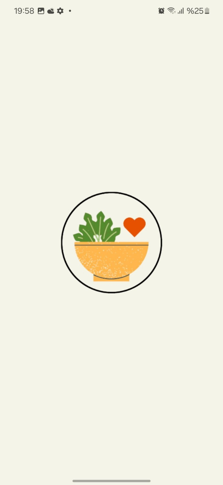
  <h1> The NomNom Collective</h1>
</div>

**The NomNom Collective** is a comprehensive mobile application designed for dietitians and patients, facilitating personalized nutrition tracking and disease-based food filtering.


---

## About the Project

This project aims to digitalize nutrition management by offering tailored interfaces for both **Dietitians** and **Patients**. It features a robust **Smart Food Filtering System** specifically designed for patients with chronic conditions (e.g., Celiac, Diabetes, Obesity, Pregnancy).

### 🌟 Key Features

* **🔐 Secure Authentication:** Implemented via **Firebase Auth**, supporting Email/Password and Google Sign-In.
* **🩺 Intelligent Disease Filtering:** Automatically filters out restricted foods based on the user's selected condition (e.g., hiding sugary foods for Diabetic patients).
* **👥 Patient Management System:** Dietitians can create new patient profiles, storing age, disease info, and diet plans locally using **SQLite**.
* **📅 Dynamic Diet Tracking:** Real-time updates for daily meal plans (Breakfast, Lunch, Dinner, Snacks) with historical data tracking.
* **📂 Hybrid Data Architecture:** Utilizes **Firebase** for user sessions/cloud auth and **SQLite** for secure, offline-capable local storage of sensitive patient records.

---

## Screenshots

### User Experience (Patient View)
The interface for patients, featuring the login screen, food search functionality, and the smart disease-based filtering system.

| Login Page | Patient Home | Food & Search |
|:---:|:---:|:---:|
| 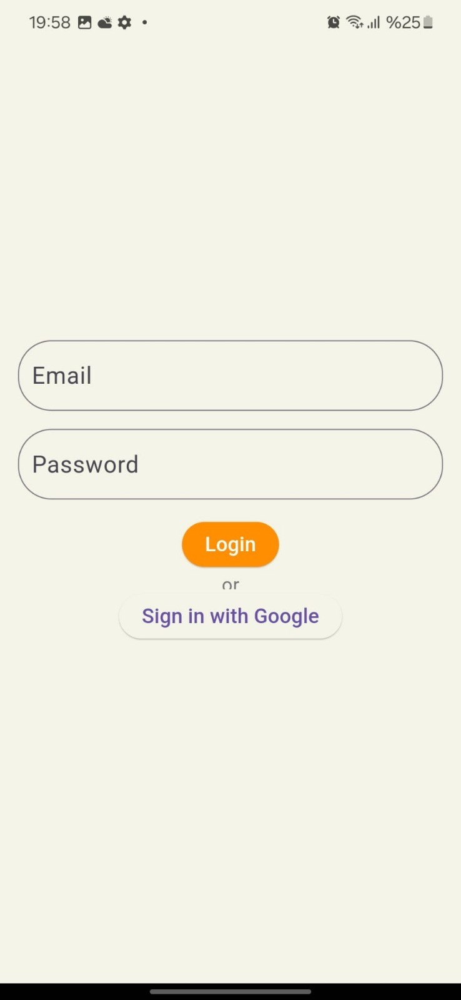 | 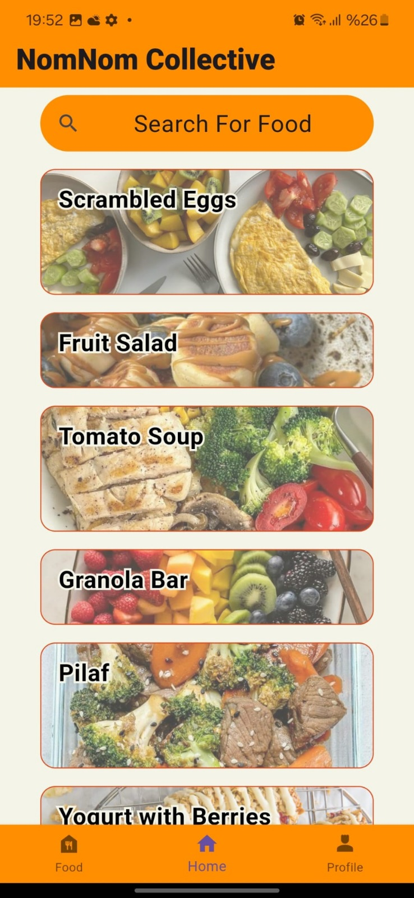 | 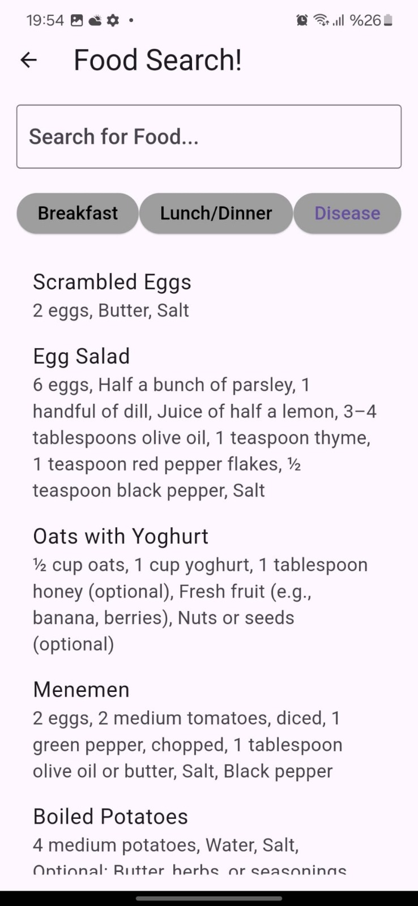 |
| **Smart Filtering** | **Ingredients Detail** | **Patient Profile** |
| 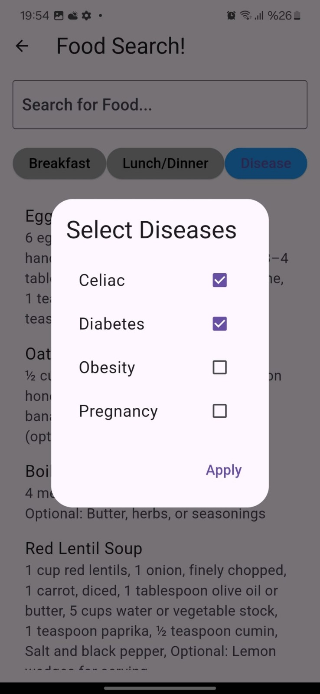 | 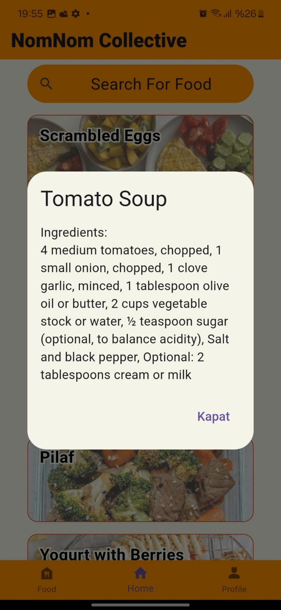 | 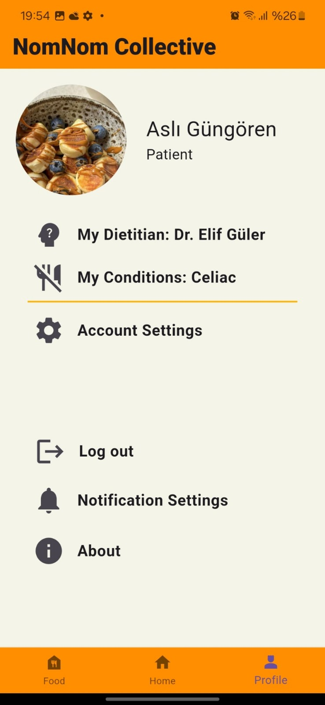 |

### Dietitian Experience (Admin View)
The management panel for Dietitians, enabling patient tracking, new patient entry, and viewing detailed diet summaries.

| Dietitian Home | Patient Management | Patient Summary (Modal) |
|:---:|:---:|:---:|
| 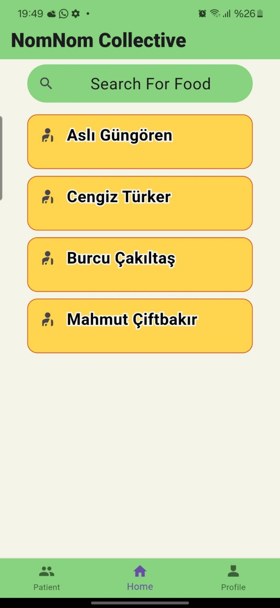 | 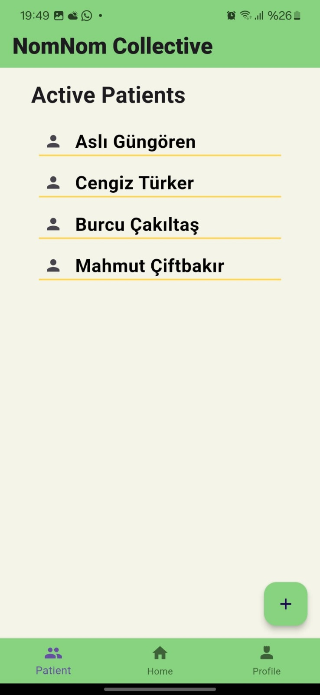 | 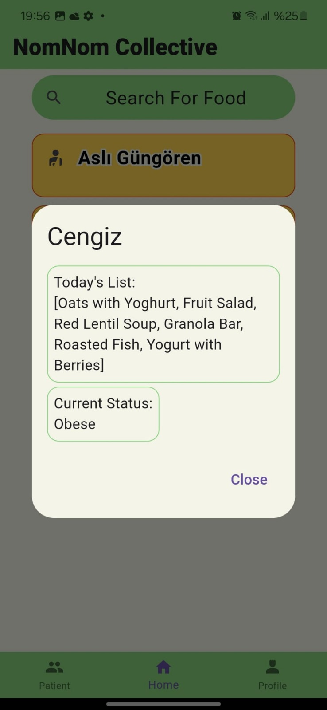 |
| **Dietitian Profile** | | |
| 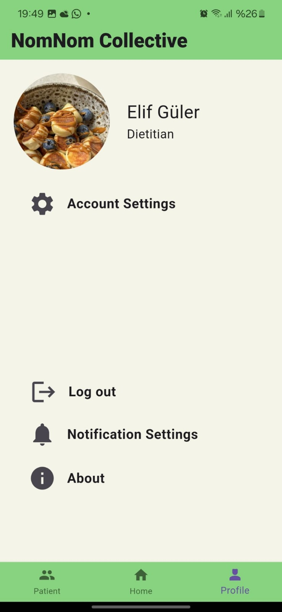 | | |

---

## Tech Stack

| Category | Technology | Usage |
|---|---|---|
| **Framework** | Flutter | Cross-platform mobile development |
| **Language** | Dart | Application logic & UI |
| **Backend / Auth** | Firebase Auth | User authentication & Google Sign-In |
| **Database** | SQLite (sqflite) | Local storage for patient & food data |
| **UI Kit** | Material Design | User interface components |

---

## 🚀 Installation & Setup

Follow these steps to run the project locally:

1.  **Clone the repository:**
    ```bash
    git clone [https://github.com/YOUR_USERNAME/the-nomnom-collective.git](https://github.com/YOUR_USERNAME/the-nomnom-collective.git)
    cd the-nomnom-collective
    ```

2.  **Install dependencies:**
    ```bash
    flutter pub get
    ```

3.  **Firebase Configuration:**
    * This project uses Firebase. You must generate your own `google-services.json` file from the Firebase Console and place it in the `android/app/` directory.

4.  **Run the app:**
    ```bash
    flutter run
    ```

---

> **Disclaimer:** This application is a **prototype** developed for demonstration purposes. Some features are simulated or use mock data to showcase the UI/UX flow and may not be fully functional.